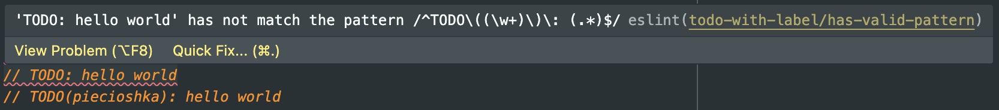

# eslint-plugin-todo-with-label

[](https://www.npmjs.com/package/eslint-plugin-todo-with-label)
[](https://badge.fury.io/js/eslint-plugin-todo-with-label)
[](https://www.npmjs.com/package/eslint-plugin-todo-with-label)
[](https://packagephobia.com/result?p=eslint-plugin-todo-with-label)
[](https://piecioshka.mit-license.org)
[](https://github.com/piecioshka/eslint-plugin-todo-with-label/actions/workflows/testing.yml)

🔨 ESLint plugin supports TODO comments with a label in parentheses

> Give a ⭐️ if this project helped you!

## Motivation



When working with code, many times there will be a situation of creating a TODO
in the code to indicate that you need to perform some action here, such as writing an error handler.
In such situations, the creation of a TODO is understandable. On the other hand,
it often happens that such a comment in the code is for a long time.
Then people reading such code, who would like to solve the TODO comment,
lack information about the author, so that they can turn to him for more details.

If we use this plugin, we will force everyone creating a TODO comment to define the author in parentheses.
This way, we will always have a point of contact for the person we can ask for help.

## Features

- ✅ Validate format of TODOs in comments _(default valid format is `TODO(label): any text here`)_
- ✅ Supports passing a custom pattern and types
- ✅ Supports 8 comment types: `TODO`, `NOTE`, `COMMENT`, `FIXME`, `BUG`, `HACK`, `INFO`, `XXX`
- ✅ Autofix with `--fix` [[#2](https://github.com/piecioshka/eslint-plugin-todo-with-label/pull/2)]

## Usage

Installation:

```bash
npm install -D eslint eslint-plugin-todo-with-label
```

Add `todo-with-label` to the plugins section of your `.eslintrc.js` configuration file:

```javascript
module.exports = {
  // ...
  plugins: ["todo-with-label"],
  rules: {
    "todo-with-label/has-valid-pattern": "error",
  },
  // ...
};
```

## Options

The optional configuration for rule `todo-with-label/has-valid-pattern`:

## Option: `types`

Default value: `["TODO", "NOTE", "COMMENT", "FIXME", "BUG", "HACK", "INFO", "XXX"]`

  - **valid**: `TODO(label): any text here`
  - **valid**: `NOTE(label): any text here`
  - **valid**: `COMMENT(label): any text here`
  - etc.

Example values:

- `["TODO"]`
  - **valid**: `TODO(label): any text here`
  - **invalid**: `NOTE(label): any text here`
- `["FOO", "BAR", "BAZ"]`
  - **valid**: `FOO(label): any text here`
  - **valid**: `BAR(label): any text here`
  - **valid**: `BAZ(label): any text here`
  - **invalid**: `TODO(label): any text here`
  - **invalid**: `NOTE(label): any text here`

## Option: `pattern`

Default value: `^TODO\\((\\w+)\\)\\: (.*)$`

- **valid**: `TODO(label): any text here`
- **invalid**: `TODO: any text here`
- **invalid**: `TODO - any text here`

Example values:

- `^TODO: (.*)$`
  - **valid**: `TODO: any text here`
- `^TODO\\((\\w+)\\)$`
  - **valid**: `TODO(label)`
- `^TODO\\((author:@\\w+)\\)\\: (.*)$`
  - **valid**: `TODO(author:@login): any text here`

⚠️ **WARNING**: When you pass a pattern, it should be a string and has _escaped_ backslashes.

## Examples

```js
module.exports = {
  // ...
  plugins: ["todo-with-label"],
  rules: {
    "todo-with-label/has-valid-pattern": [
      "error",
      {
        types: ["TODO"],
        pattern: "^TODO\\((author:@\\w+)\\)\\: (.*)$",
      },
    ],
  },
};
```

## Related

- [eslint-config-piecioshka](https://github.com/piecioshka/eslint-config-piecioshka)
- [export-eslint-config](https://github.com/piecioshka/export-eslint-config)

## License

[The MIT License](https://piecioshka.mit-license.org) @ 2023
